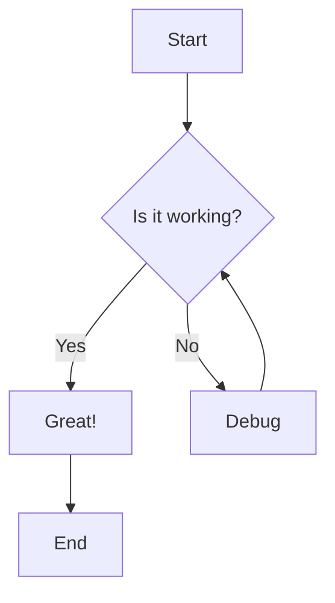
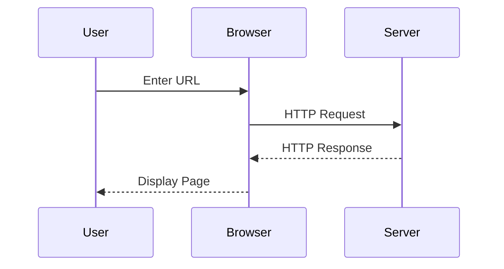
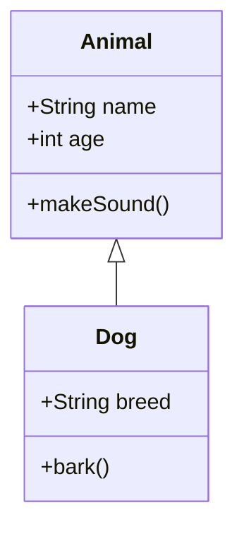
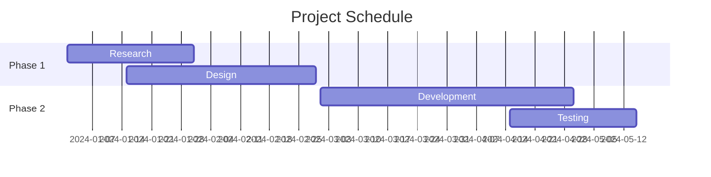
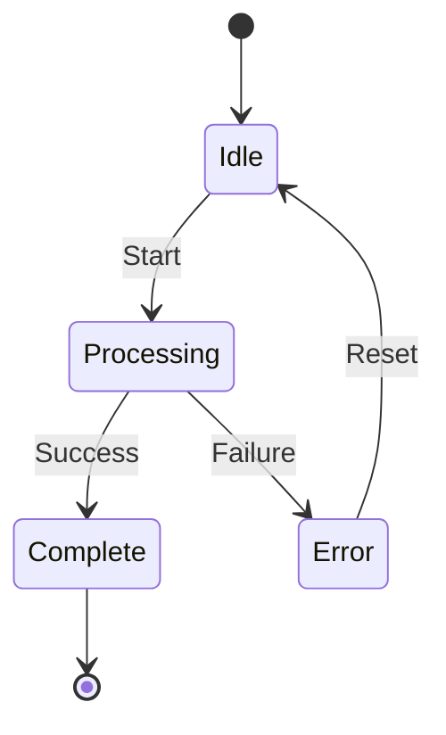
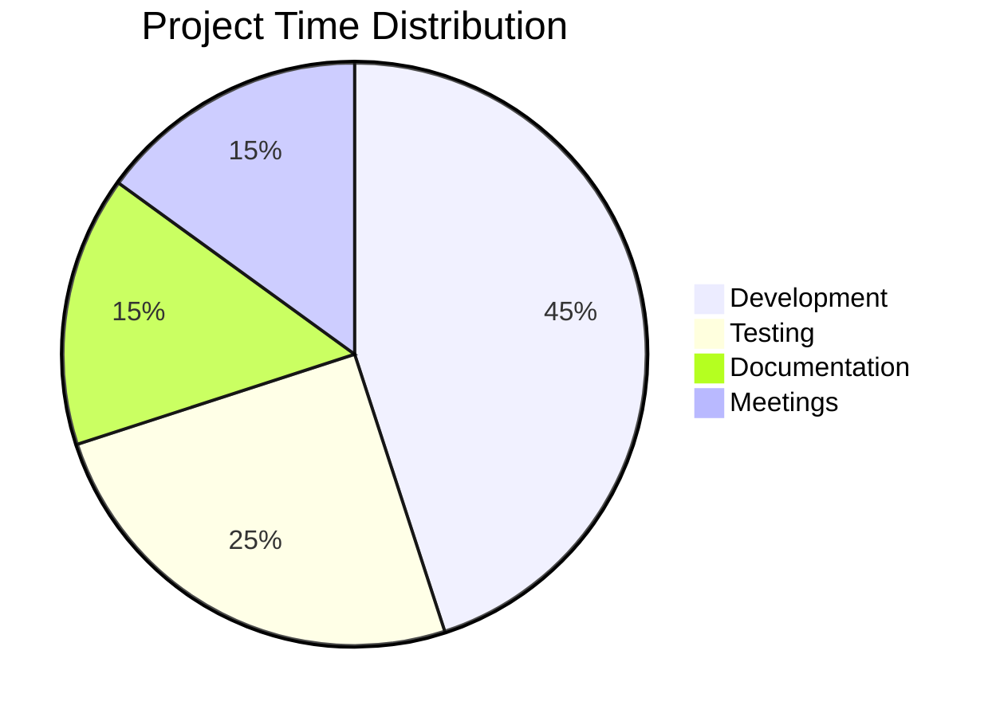

# GitHub Markdown Complete Reference Guide

GitHub's markdown syntax enables rich formatting for documentation, issues, pull requests, and discussions. This comprehensive guide covers everything from basic text styling to advanced features like diagrams and mathematical expressions.

## Basic syntax essentials

GitHub markdown builds on standard markdown with powerful extensions. **Headings use 1-6 hash symbols** (`#`) before text, with more hashes creating smaller headings. GitHub automatically generates a table of contents from headings in files, making navigation seamless.

Text styling provides multiple emphasis options. Wrap text in `**double asterisks**` or `__double underscores__` for **bold**, single `*asterisks*` or `_underscores_` for *italics*, and `~~double tildes~~` for ~~strikethrough~~. **Combine these for nested emphasis** like `**This text is _extremely_ important**` to create **This text is _extremely_ important**. For scientific notation, use `<sub>subscript</sub>` and `<sup>superscript</sup>` HTML tags.

Line breaks behave differently in comments versus markdown files. In issues and pull requests, GitHub renders line breaks automatically. In `.md` files, you need **two trailing spaces, a backslash, or `<br/>` tag** to force a line break. Leaving a blank line between paragraphs creates proper paragraph separation in all contexts.

## Headings and document structure

Creating effective headings establishes clear document hierarchy:

```markdown
# First-level heading (largest)
## Second-level heading
### Third-level heading
#### Fourth-level heading
##### Fifth-level heading
###### Sixth-level heading (smallest)
```

**GitHub automatically generates anchors for all headings**, enabling direct linking to sections. Hover over any rendered heading to reveal the link icon. To manually create section links, follow these rules: convert letters to lowercase, replace spaces with hyphens, remove punctuation, strip markup formatting. For example, `## This'll be a _Helpful_ Section!` becomes `#thisll-be-a-helpful-section`. If duplicate headings exist, GitHub appends `-1`, `-2`, etc.

Custom HTML anchors work for non-heading locations:

```markdown
<a name="custom-anchor"></a>
Some important text you want to link directly.

[Link to that custom anchor](#custom-anchor)
```

## Text formatting and styling

| Style | Syntax | Keyboard Shortcut | Example | Output |
|-------|--------|------------------|---------|--------|
| Bold | `** **` or `__ __` | Cmd+B / Ctrl+B | `**Bold text**` | **Bold text** |
| Italic | `* *` or `_ _` | Cmd+I / Ctrl+I | `*Italic text*` | *Italic text* |
| Strikethrough | `~~ ~~` | None | `~~Strikethrough~~` | ~~Strikethrough~~ |
| Bold and italic | `*** ***` | None | `***Important***` | ***Important*** |
| Bold with nested italic | `** **` and `_ _` | None | `**Text is _very_ important**` | **Text is _very_ important** |
| Subscript | `<sub> </sub>` | None | `H<sub>2</sub>O` | H<sub>2</sub>O |
| Superscript | `<sup> </sup>` | None | `X<sup>2</sup>` | X<sup>2</sup> |
| Underline | `<ins> </ins>` | None | `<ins>Underlined</ins>` | <ins>Underlined</ins> |

## Quoting and code formatting

Blockquotes use the greater-than symbol (`>`) to create indented, gray-styled quoted text:

```markdown
Regular text here

> This text appears as a quote
> with distinctive styling
```

**Inline code uses single backticks** to highlight commands or code within sentences. Press Cmd+E (Mac) or Ctrl+E (Windows/Linux) for quick insertion:

```markdown
Use `git status` to list all modified files that haven't been committed.
```

**Fenced code blocks use triple backticks** for multi-line code. Place blank lines before and after for better readability:

````markdown
```
git status
git add .
git commit -m "Initial commit"
```
````

Display triple backticks inside code blocks by wrapping with quadruple backticks:

`````markdown
````
Look! You can see my ```backticks``` inside.
````
`````

## Syntax highlighting for code

Add a language identifier immediately after opening backticks to enable syntax highlighting. **GitHub uses Linguist for language detection**, supporting hundreds of languages. Always use lowercase identifiers for compatibility with GitHub Pages.

Ruby example:

````markdown
```ruby
require 'redcarpet'
markdown = Redcarpet.new("Hello World!")
puts markdown.to_html
```
````

JavaScript example:

````markdown
```javascript
function greet(name) {
  console.log(`Hello, ${name}!`);
}
greet('World');
```
````

Python example:

````markdown
```python
def factorial(n):
    return 1 if n <= 1 else n * factorial(n - 1)
print(factorial(5))
```
````

## Links and navigation

Create inline links by wrapping text in brackets and URLs in parentheses. Use Cmd+K or Ctrl+K for quick link insertion:

```markdown
Visit [GitHub Pages](https://pages.github.com/) for free hosting.
```

**GitHub auto-links valid URLs** written directly in comments. For section linking within documents, use the heading anchor format:

```markdown
[Jump to Basic Syntax](#basic-syntax-essentials)
```

Relative links enable repository navigation:

```markdown
[Contributing Guide](docs/CONTRIBUTING.md)
[Parent Directory](../../README.md)
[Repository Root](/LICENSE)
```

**Relative paths automatically adjust** to your current branch. Links starting with `/` are relative to repository root. Use standard path operators: `./` for current directory, `../` for parent directory.

For images in your repository:

| Context | Relative Link Pattern |
|---------|----------------------|
| Same branch `.md` file | `/assets/images/logo.png` |
| Different branch `.md` file | `/../main/assets/images/logo.png` |
| Issues/PRs/comments | `../blob/main/assets/images/logo.png?raw=true` |
| Another repository | `/../../../../org/repo/blob/main/assets/images/logo.png` |

## Images and visual content

Display images with exclamation mark, alt text in brackets, and URL in parentheses:

```markdown

```

**Use relative links for repository images** rather than absolute URLs for portability. GitHub supports drag-and-drop image uploads directly into issues, pull requests, and markdown files. The `<picture>` HTML element works for responsive images with multiple sources.

## Color visualization

Display color swatches inline using backticks with supported color formats. **GitHub renders color visualizations** in issues, pull requests, and discussions:

```markdown
The brand uses `#0969DA` blue, `rgb(9, 105, 218)` as RGB, and `hsl(212, 92%, 45%)` in HSL.
```

Supported formats:

| Color Model | Syntax Format | Example |
|-------------|---------------|---------|
| HEX | `#RRGGBB` | `#FF5733` |
| RGB | `rgb(R,G,B)` | `rgb(255, 87, 51)` |
| HSL | `hsl(H,S,L)` | `hsl(9, 100%, 60%)` |

**Note:** Colors cannot have leading or trailing spaces within backticks. Color visualization only appears in issues, PRs, and discussions, not rendered markdown files.

## Lists and task management

Unordered lists use hyphens, asterisks, or plus signs interchangeably:

```markdown
- First item
- Second item
- Third item

* Alternative syntax
* Works identically
* Use consistently

+ Plus signs also work
+ Choose your preference
+ Maintain style consistency
```

Ordered lists use numbers followed by periods:

```markdown
1. First step
2. Second step
3. Third step
```

**GitHub automatically renumbers** ordered lists if you change the sequence. You can use `1.` for every item and GitHub will number them correctly.

Nested lists require proper indentation:

```markdown
1. Main topic
   - Subtopic one
   - Subtopic two
     - Nested subtopic
     - Another nested item
2. Second main topic
   1. Numbered subtopic
   2. Another numbered subtopic
```

**Align nested list markers** directly below the first character of the parent item text. In monospaced editors, this is straightforward. In web comments, count characters before the content (e.g., `100. ` is five characters) and indent by that amount.

Task lists create interactive checkboxes:

```markdown
- [x] Completed task #739
- [ ] Pending task
- [ ] Add celebration when done :tada:
- [ ] \(Optional) Escape parentheses with backslash
```

**Check tasks by clicking checkboxes** in rendered markdown. Use `[x]` for completed, `[ ]` for incomplete. Task lists work in issues, pull requests, and comments.

## Organizing information with tables

Create tables using pipes (`|`) for columns and hyphens (`-`) for headers. **Include a blank line before tables** for correct rendering:

```markdown
| Header One | Header Two | Header Three |
| ---------- | ---------- | ------------ |
| Cell 1     | Cell 2     | Cell 3       |
| Cell 4     | Cell 5     | Cell 6       |
```

**Pipes on table edges are optional**. Cells don't need perfect alignment. **Minimum three hyphens per header column**:

```markdown
| Command | Description |
| --- | --- |
| git status | List all new or modified files |
| git diff | Show unstaged changes |
```

Align columns by adding colons to header row hyphens:

```markdown
| Left-aligned | Center-aligned | Right-aligned |
| :----------- | :------------: | ------------: |
| Default      | Centered       | Right         |
| Left         | Middle         | Right         |
```

**Format content within cells** using inline code, bold, italic, and links:

```markdown
| Command | Description |
| --- | --- |
| `git status` | List all *new or modified* files |
| `git diff` | Show differences that **haven't been staged** |
| `git log` | View [commit history](https://git-scm.com) |
```

Escape pipe characters inside cells with backslash:

```markdown
| Character | Symbol |
| --------- | ------ |
| Pipe      | \|     |
| Backslash | \\     |
```

## Advanced code blocks and highlighting

Fenced code blocks provide clean syntax for multi-line code. **Place blank lines before and after** for optimal raw formatting readability:

````markdown
```
function calculateTotal(items) {
  return items.reduce((sum, item) => sum + item.price, 0);
}
```
````

**Within lists, indent non-fenced code by eight spaces** to preserve formatting:

```markdown
1. First step
2. Second step

        Code block inside list
        Indented by 8 spaces

3. Third step
```

Language identifiers enable sophisticated syntax highlighting. GitHub supports hundreds of languages through Linguist:

````markdown
```typescript
interface User {
  name: string;
  age: number;
  email?: string;
}

const user: User = {
  name: "Alice",
  age: 30
};
```
````

````markdown
```sql
SELECT users.name, orders.total
FROM users
INNER JOIN orders ON users.id = orders.user_id
WHERE orders.date > '2024-01-01'
ORDER BY orders.total DESC;
```
````

````markdown
```bash
#!/bin/bash
for file in *.md; do
  echo "Processing $file"
  markdown-lint "$file"
done
```
````

## Creating diagrams with Mermaid

Mermaid transforms text into interactive diagrams. **Use the `mermaid` language identifier** in fenced code blocks. GitHub supports flowcharts, sequence diagrams, class diagrams, state diagrams, Gantt charts, and more.

Flowchart example:

````markdown

````

Sequence diagram example:

````markdown

````

Class diagram example:

````markdown

````

Gantt chart for project timelines:

````markdown

````

State diagram example:

````markdown

````

Pie chart for data visualization:

````markdown

````

**Check Mermaid version compatibility** by rendering:

````markdown
```mermaid
info
```
````

## Geographic maps with GeoJSON and TopoJSON

Create interactive maps using GeoJSON or TopoJSON syntax. **Use `geojson` or `topojson` language identifiers** for map rendering.

GeoJSON polygon example:

````markdown
```geojson
{
  "type": "FeatureCollection",
  "features": [
    {
      "type": "Feature",
      "properties": {
        "name": "Sample Region"
      },
      "geometry": {
        "type": "Polygon",
        "coordinates": [[
          [-90, 35],
          [-90, 30],
          [-85, 30],
          [-85, 35],
          [-90, 35]
        ]]
      }
    }
  ]
}
```
````

TopoJSON example with multiple geometries:

````markdown
```topojson
{
  "type": "Topology",
  "transform": {
    "scale": [0.0005, 0.0001],
    "translate": [100, 0]
  },
  "objects": {
    "example": {
      "type": "GeometryCollection",
      "geometries": [
        {
          "type": "Point",
          "properties": {"label": "Point A"},
          "coordinates": [4000, 5000]
        },
        {
          "type": "LineString",
          "properties": {"label": "Path"},
          "arcs": [0]
        }
      ]
    }
  },
  "arcs": [[[4000, 0], [1999, 9999], [2000, -9999]]]
}
```
````

## 3D models with STL

Display interactive 3D models using ASCII STL syntax with the `stl` language identifier:

````markdown
```stl
solid cube_corner
  facet normal 0.0 -1.0 0.0
    outer loop
      vertex 0.0 0.0 0.0
      vertex 1.0 0.0 0.0
      vertex 0.0 0.0 1.0
    endloop
  endfacet
  facet normal 0.0 0.0 -1.0
    outer loop
      vertex 0.0 0.0 0.0
      vertex 0.0 1.0 0.0
      vertex 1.0 0.0 0.0
    endloop
  endfacet
  facet normal -1.0 0.0 0.0
    outer loop
      vertex 0.0 0.0 0.0
      vertex 0.0 0.0 1.0
      vertex 0.0 1.0 0.0
    endloop
  endfacet
  facet normal 0.577 0.577 0.577
    outer loop
      vertex 1.0 0.0 0.0
      vertex 0.0 1.0 0.0
      vertex 0.0 0.0 1.0
    endloop
  endfacet
endsolid
```
````

GitHub renders STL models as rotatable 3D objects in the browser.

## Mathematical expressions with LaTeX

GitHub supports LaTeX-formatted mathematics using MathJax. **Mathematical expressions render in issues, pull requests, discussions, wikis, and markdown files** with full accessibility support.

Inline math uses dollar sign delimiters:

```markdown
The quadratic formula is $x = \frac{-b \pm \sqrt{b^2-4ac}}{2a}$ for equations $ax^2 + bx + c = 0$.
```

Alternative inline syntax with backticks prevents markdown conflicts:

```markdown
When discussing costs in algebra: $`\sqrt{x+1}`$ uses alternative delimiters.
```

Block math expressions use double dollar signs:

```markdown
**The Cauchy-Schwarz Inequality**\
$$\left( \sum_{k=1}^n a_k b_k \right)^2 \leq \left( \sum_{k=1}^n a_k^2 \right) \left( \sum_{k=1}^n b_k^2 \right)$$
```

**Alternatively, use `math` code blocks** without dollar delimiters:

````markdown
**The Cauchy-Schwarz Inequality**
```math
\left( \sum_{k=1}^n a_k b_k \right)^2 \leq \left( \sum_{k=1}^n a_k^2 \right) \left( \sum_{k=1}^n b_k^2 \right)
```
````

Matrix notation:

````markdown
```math
\begin{bmatrix}
a & b \\
c & d
\end{bmatrix}
```
````

Summations and integrals:

```markdown
$$\sum_{i=1}^{n} i = \frac{n(n+1)}{2}$$

$$\int_{a}^{b} f(x)\,dx$$
```

**Display dollar signs with math expressions** by escaping:

```markdown
Calculate the square root of $`\sqrt{\$100}`$ to find $`\$10`$.
```

Outside math expressions on the same line, use span tags:

```markdown
To split <span>$</span>100 in half, we calculate $100/2 = 50$.
```

Common mathematical symbols and operators:

- Greek letters: `\alpha`, `\beta`, `\gamma`, `\Delta`, `\Omega`
- Operators: `\times`, `\div`, `\pm`, `\mp`, `\cdot`
- Relations: `\leq`, `\geq`, `\neq`, `\approx`, `\equiv`
- Set notation: `\in`, `\notin`, `\subset`, `\subseteq`, `\cup`, `\cap`
- Calculus: `\partial`, `\nabla`, `\infty`, `\lim`, `\to`
- Logic: `\forall`, `\exists`, `\neg`, `\land`, `\lor`, `\implies`

## Footnotes for references

Add footnotes using bracket syntax with caret:

```markdown
Here is a sentence with a footnote[^1]. Another sentence with a longer footnote[^longnote].

[^1]: This is the first footnote.

[^longnote]: This footnote has multiple lines.
    Indent subsequent lines with 2 spaces.
    Add as many lines as needed.
```

**Footnotes always render at the bottom** regardless of placement in source. Write footnotes near references for maintainability, but they'll display in the footer. Footnotes aren't supported in wikis.

## Alerts for emphasis

Alerts use special blockquote syntax to highlight critical information. **Five alert types** provide contextual emphasis:

```markdown
> [!NOTE]
> Useful information that users should know, even when skimming content.

> [!TIP]
> Helpful advice for doing things better or more easily.

> [!IMPORTANT]
> Key information users need to know to achieve their goal.

> [!WARNING]
> Urgent info that needs immediate user attention to avoid problems.

> [!CAUTION]
> Advises about risks or negative outcomes of certain actions.
```

**Use alerts sparingly**—limit to one or two per article. Avoid consecutive alerts and nesting alerts within other elements. GitHub renders each type with distinctive colors and icons.

## Mentions and references

Mention users or teams by typing `@` plus their username:

```markdown
@octocat Can you review this change?
@github/support What's your recommendation?
```

**Typing `@` triggers autocomplete** listing available users and teams. Mentions create notifications for users with repository read access. Parent team mentions notify child team members.

Reference issues and pull requests by typing `#`:

```markdown
Fixed the bug reported in #123
This resolves #456 and addresses concerns from #789
```

**Typing `#` shows suggested issues and PRs** within the repository. Press Tab or Enter to complete selections. GitHub auto-links issue and PR numbers.

If custom autolinks are configured, external references (JIRA issues, Zendesk tickets) convert to shortened links automatically.

## Emojis for expression

Add emoji using colon syntax:

```markdown
:sparkles: This feature is amazing! :rocket:
Great work @teammate :+1: :tada:
:warning: Be careful with this approach :thinking:
```

**Typing `:` triggers emoji autocomplete**. GitHub supports hundreds of emojis including :smile:, :heart:, :fire:, :rocket:, :star:, :zap:, :bulb:, :bug:, :construction:, :white_check_mark:, and many more.

## HTML comments and escaping

Hide content from rendered output using HTML comments:

```markdown
<!-- This comment won't appear in rendered markdown -->
<!-- Use comments for notes, TODOs, or conditional content -->

Visible content here
<!-- Hidden explanation or planning notes -->
More visible content
```

**Escape markdown formatting** with backslash:

```markdown
Let's rename \*our-new-project\* to \*our-old-project\* without italics.
Use \# for literal hash instead of heading.
Display \[brackets\] and \(parentheses\) literally.
```

Common characters requiring escape: `\*`, `\_`, `\#`, `\[`, `\]`, `\(`, `\)`, `\>`, `\+`, `\-`, `\.`, `\!`, `\|`

**Note:** Markdown formatting cannot be escaped in issue or PR titles.

## Uploading assets

Upload files by dragging and dropping, selecting from file browser, or pasting. **GitHub accepts images and other assets** in issues, pull requests, comments, and markdown files. Uploaded images receive unique URLs for embedding.

## Viewing source markdown

When viewing rendered markdown files, **click "Code" at the top** to disable rendering and view raw source. Source view enables line linking and copying—features unavailable in rendered view. Toggle between views as needed.

## Quick reference summary

This comprehensive guide covered GitHub's complete markdown implementation:

**Text formatting** includes bold, italic, strikethrough, subscript, superscript, and underline using markdown syntax or HTML tags. **Headings** create document structure with automatic table of contents and anchor generation. **Links** support inline, relative, and section linking with automatic URL detection.

**Lists** handle unordered, ordered, nested, and task list formats with interactive checkboxes. **Tables** organize data with column alignment, embedded formatting, and special character escaping. **Code blocks** provide syntax highlighting for hundreds of languages with fenced block syntax.

**Diagrams** transform text into visuals using Mermaid flowcharts, sequence diagrams, class diagrams, state machines, Gantt charts, and pie charts. **Geographic maps** render from GeoJSON and TopoJSON data. **3D models** display interactively from STL files.

**Mathematical expressions** use LaTeX syntax via MathJax for inline and block equations. **Alerts** emphasize critical information with five contextual types. **Mentions** notify users and teams while **references** link issues and pull requests automatically.

**Color visualization** displays HEX, RGB, and HSL values inline. **Emojis** add expression with colon shortcodes. **Footnotes** provide references at document bottom. **Comments** hide content and **escaping** displays literal markdown characters.

Every feature includes practical examples and usage patterns for immediate application. This self-contained reference enables offline learning and serves as a complete markdown syntax resource for GitHub platform development.